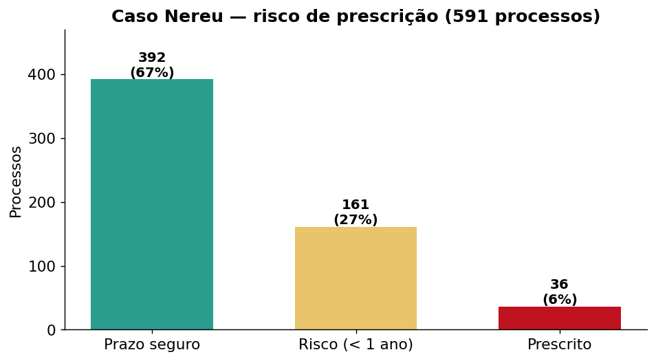
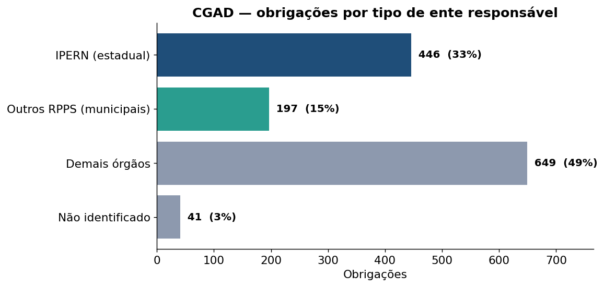
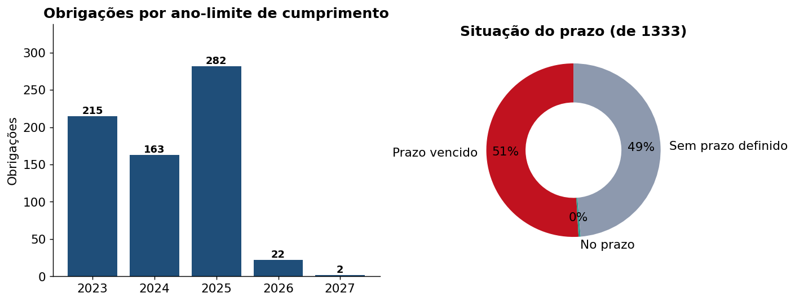

<!-- _class: lead -->
<!-- _backgroundColor: #1f4e79 -->
<!-- _color: #ffffff -->

# Acompanhamento de Decisões e Arrecadação

## Apresentação ao Presidente do TCE/RN

Coordenadoria de Controle de Decisões (CCD)
**Junho de 2026**

---

## Agenda

1. **Arrecadação do FRAP** — resultado de 2026 e o novo canal Pix/Cartão

2. **Caso Nereu** — débitos, notificações e risco de prescrição

3. **Acervo do CGAD** — obrigações e recomendações em acompanhamento

Fonte: banco <code>BdDIP</code> (tabelas FRAP*, Obrigação, Recomendação) e planilha consolidada de débitos. Dados extraídos em 01/06/2026.

---

<!-- _class: divider -->

# 1. Arrecadação do FRAP

### Fundo de Reaparelhamento e Aperfeiçoamento

---

## Arrecadação do FRAP em 2026

R$ 771,8 mil arrecadados em 2026 (parcial, até abril)

### Novo canal Pix / Cartão de crédito

R$ 1.481,87 confirmados — **1 pagamento via Pix** (15/04/2026); ainda **nenhum** via cartão de crédito.

Piloto iniciado em fev/2026: **40 solicitações** (R$ 467 mil, em 21 débitos) aguardam conciliação — o canal está em fase inicial.

---

<!-- _class: divider -->

# 2. Caso Nereu

### Débitos, notificações e prescrição

---

## Panorama dos débitos

| Indicador | Quantidade | Valor atualizado |
|---|---:|---:|
| Débitos imputados | **594** | **R$ 4.871.938,09** |
| Processos (origem × execução) | **591** | — |
| Notificados (desconto em folha) | **41** | **R$ 415.405,29** |

Composição: **451 multas** e **143 multas cominatórias**.

Fonte: Exe_Debito, Cit_Citacoes e informações da CCD, consolidadas em <code>debitos_nereu_planilha_final.xlsx</code>.

---

## Ação da CCD: notificação para desconto em folha

- **41 processos** já notificados para **desconto em folha**, somando **R$ 415 mil** atualizados
- Notificação mais recente em **27/03/2026**
- Mecanismo que transforma a decisão em **cobrança efetiva**, sem depender de execução judicial

8,5% do valor total já está em via de cobrança por desconto em folha.

---

## Risco de prescrição

**161 processos** entram em risco de prescrição em **menos de 1 ano** — prioridade de atuação.

---

## Pagamentos e síntese

- **10 parcelas** já pagas via FRAP — **R$ 12.435,15**
- A maior parte do valor (**R$ 4,87 mi**) permanece **em aberto**
- **36 processos já prescritos** e **161 em risco** exigem priorização

**Recomendação:** acelerar notificação/desconto nos **161 processos em risco** antes do prazo prescricional.

---

<!-- _class: divider -->

# 3. Acervo do CGAD

### Cadastro Geral de Acompanhamento de Decisões

---

## Volume e cobertura

| Acervo em acompanhamento | Total |
|---|---:|
| **Obrigações** (de fazer / não fazer) | **1.333** |
| **Recomendações** | **899** |
| Decisões classificadas | **375** |

- **684 obrigações** têm **prazo de cumprimento** fixado — **679 já vencidos**
- **634 obrigações** com **multa cominatória** (R$ 314 mil/período)
- Decisões classificadas: **198 determinações** + 177 outras

A base do CGAD registra o <strong>prazo</strong> (data-limite), não a comprovação do cumprimento.

---

## Sobre quem recaem as obrigações

**Previdência concentra quase metade** (48%) — o **IPERN responde por 1/3** das obrigações. (o mesmo IPERN do caso Nereu)

---

## Prazos de cumprimento e situação

**Metade dos prazos já venceu** — exige verificação ativa do cumprimento pelas unidades.

A base registra a data-limite, não a comprovação. "Sem prazo definido" = obrigação sem data-limite cadastrada.

---

## CGAD — destaques

- 📚 **2.232** itens em acompanhamento ativo (1.333 obrigações + 899 recomendações)
- ⏰ **679 obrigações com prazo vencido** — gargalo de verificação do cumprimento
- 🏛️ Forte concentração no **setor previdenciário (RPPS)**, com destaque ao **IPERN**
- 💰 **634 multas cominatórias** como instrumento de indução ao cumprimento
- 🔗 **Sinergia com o caso Nereu**: previdência estadual é, ao mesmo tempo, maior devedora de obrigações e foco da cobrança de débitos

---

<!-- _class: lead -->
<!-- _backgroundColor: #1f4e79 -->
<!-- _color: #ffffff -->

# Síntese

**FRAP**: **R$ 771,8 mil** arrecadados em 2026; novo canal Pix/Cartão em piloto
**Nereu**: R$ 4,87 mi em débitos — **161 processos** em risco de prescrição
**CGAD**: 1.333 obrigações acompanhadas — **48% no setor previdenciário**

### Próximos passos
Conciliar o canal Pix/Cartão · Priorizar processos em risco · Intensificar o acompanhamento dos RPPS

---

<!-- _class: lead -->
<!-- _backgroundColor: #2a9d8f -->
<!-- _color: #ffffff -->

# Obrigado

**Coordenadoria de Controle de Decisões — CCD**
TCE/RN
